# Navigation Screenshots Documentation

## Overview

This document provides a comprehensive visual reference for the navigation architecture of the Surely app. The app uses **React Navigation** with a drawer + stack navigation pattern that adapts to different screen sizes.

### Navigation Architecture

- **Root Navigator**: Drawer Navigator (contains main sections)
- **Section Navigators**: Stack Navigators for each section (list + detail screens)
- **Responsive Behavior**: Navigation UI adapts based on screen width breakpoints

### Breakpoints

The app uses two breakpoints defined in `src/breakpoints.js`:

- **Large Breakpoint** (≥ 600px): iPad and desktop views

  - Drawer is **permanent** (always visible as sidebar)
  - No hamburger menu toggle
  - Drawer width: 220px

- **Medium Breakpoint** (< 600px): iPhone and mobile views
  - Drawer is **collapsible** (slides in from left)
  - Hamburger menu toggle visible in header
  - Drawer overlays content when open

### Navigation Elements

#### Header Bar

Each screen displays a header bar (see `src/components/NavigationBar.js`) with:

- **Title**: Screen name or content-specific title
- **Back Button**: Shows when screen is not the initial route in its stack
- **Hamburger Menu**: Shows only on medium breakpoint to toggle drawer

#### Drawer Items

**When logged in:**

- Available
- Tomorrow
- Future
- Completed
- Deleted
- Categories
- About
- Sign out

**When logged out:**

- Sign in
- Sign up
- About

### Screenshot Devices

- **Large Breakpoint**: iPad Pro 11-inch (M5) - iOS 18.2
- **Medium Breakpoint**: iPhone 17 - iOS 18.2

---

## Screen Documentation

### Available List

**URL**: `/todos/available`
**Stack**: AvailableStack → AvailableTodos
**Auth Required**: Yes

#### Header Elements

| Breakpoint | Title     | Back Button | Hamburger Menu |
| ---------- | --------- | ----------- | -------------- |
| Large      | Available | No          | No             |
| Medium     | Available | No          | Yes            |

#### Drawer Behavior

| Breakpoint | Type        | Behavior                  |
| ---------- | ----------- | ------------------------- |
| Large      | Permanent   | Always visible as sidebar |
| Medium     | Collapsible | Toggle via hamburger menu |

#### Screenshots

##### Large Breakpoint (≥ 600px)

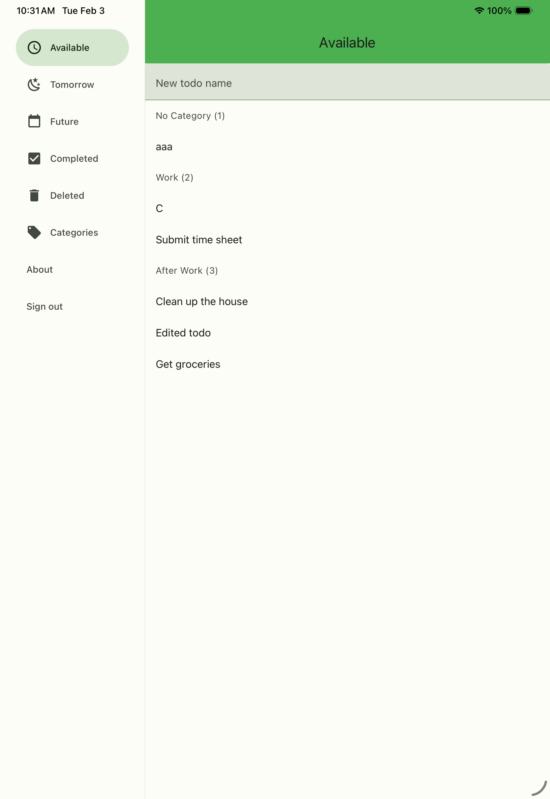

##### Medium Breakpoint (< 600px)

**Drawer Closed:**

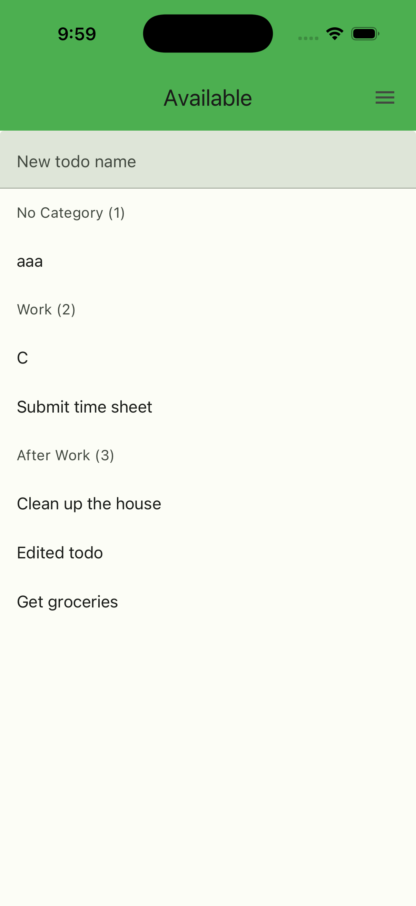

**Drawer Open:**

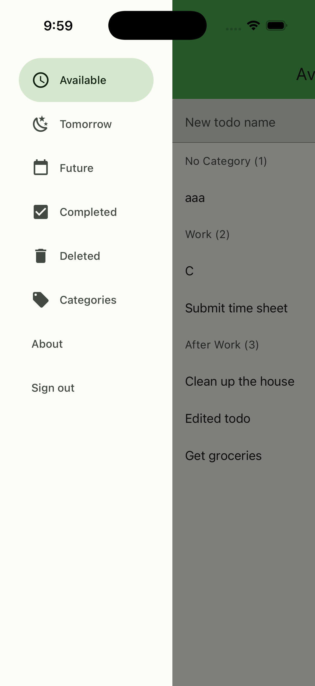

#### Navigation Elements

- **Add button** (+): Creates new todo
- **Todo list items**: Tap to navigate to detail screen
- **Search bar**: Filter todos by name
- **Pagination controls**: Navigate between pages
- **Drawer items**: Navigate to other sections

#### Notes

- This is the initial/default screen after login
- Shows available todos that can be acted upon
- Back button is not shown (initial route in stack)

---

### Available Detail

**URL**: `/todos/available/:id`
**Stack**: AvailableStack → AvailableTodoDetail
**Auth Required**: Yes

#### Header Elements

| Breakpoint | Title      | Back Button | Hamburger Menu |
| ---------- | ---------- | ----------- | -------------- |
| Large      | Todo title | Yes         | No             |
| Medium     | Todo title | Yes         | Yes            |

#### Drawer Behavior

| Breakpoint | Type        | Behavior                  |
| ---------- | ----------- | ------------------------- |
| Large      | Permanent   | Always visible as sidebar |
| Medium     | Collapsible | Toggle via hamburger menu |

#### Screenshots

##### Large Breakpoint (≥ 600px)

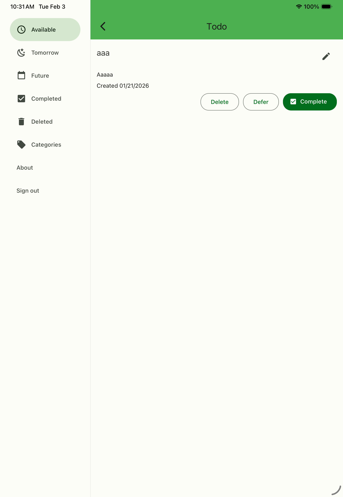

##### Medium Breakpoint (< 600px)

**Drawer Closed:**

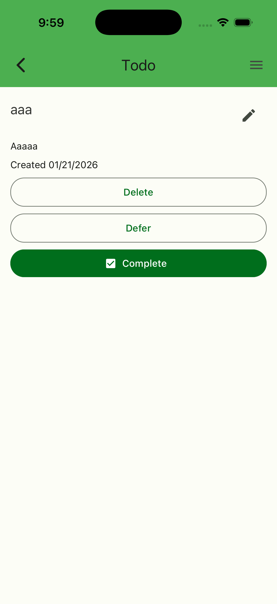

**Drawer Open:**

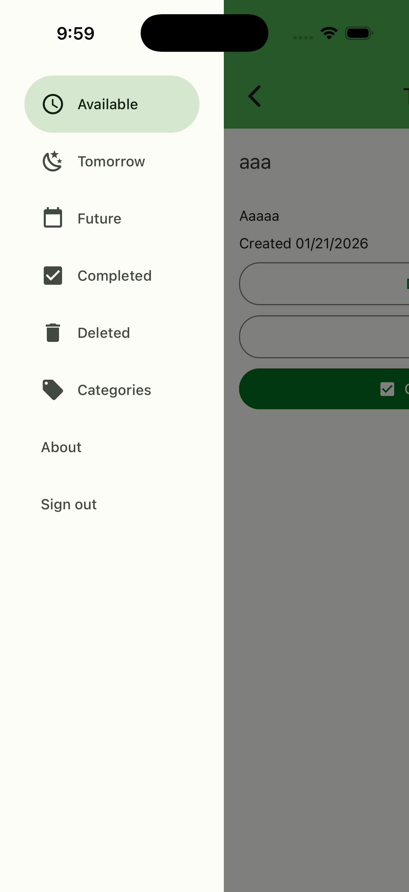

#### Navigation Elements

- **Back button**: Returns to Available List
- **Edit button**: Switches to edit mode
- **Complete button**: Marks todo as complete (navigates to Completed section)
- **Delete button**: Moves todo to Deleted section
- **Defer button**: Moves todo to Tomorrow or Future
- **Event log**: Shows history of todo actions

#### Notes

- Title in header shows the todo's name
- Back button is present (not initial route in stack)
- Displays read-only view of todo details
- Action buttons trigger navigation to other sections

---

### Tomorrow List

**URL**: `/todos/tomorrow`
**Stack**: TomorrowStack → TomorrowTodos
**Auth Required**: Yes

#### Header Elements

| Breakpoint | Title    | Back Button | Hamburger Menu |
| ---------- | -------- | ----------- | -------------- |
| Large      | Tomorrow | No          | No             |
| Medium     | Tomorrow | No          | Yes            |

#### Drawer Behavior

| Breakpoint | Type        | Behavior                  |
| ---------- | ----------- | ------------------------- |
| Large      | Permanent   | Always visible as sidebar |
| Medium     | Collapsible | Toggle via hamburger menu |

#### Screenshots

##### Large Breakpoint (≥ 600px)

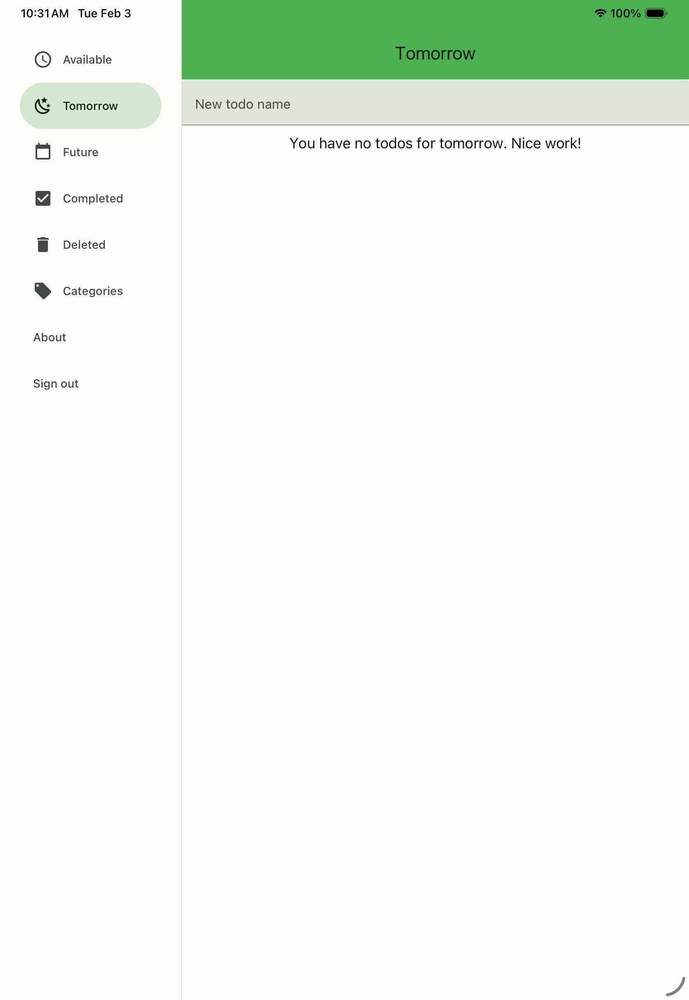

##### Medium Breakpoint (< 600px)

**Drawer Closed:**

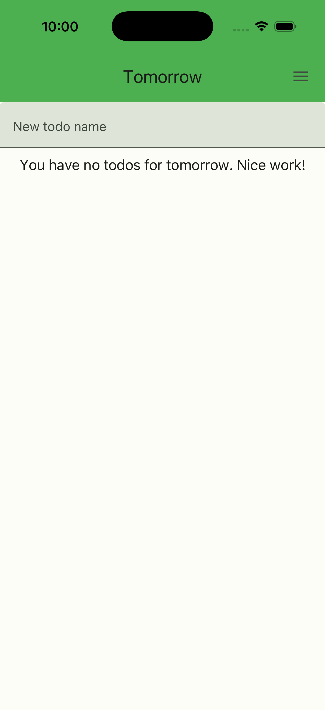

**Drawer Open:**

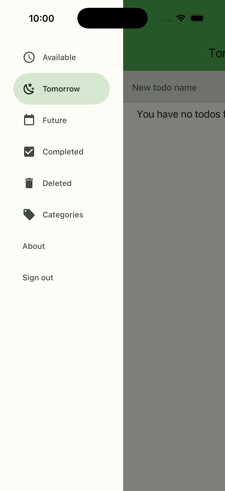

#### Navigation Elements

- **Add button** (+): Creates new todo
- **Todo list items**: Tap to navigate to detail screen
- **Search bar**: Filter todos by name
- **Pagination controls**: Navigate between pages
- **Drawer items**: Navigate to other sections

#### Notes

- Shows todos deferred to tomorrow
- Empty state message shown when no todos
- Back button is not shown (initial route in stack)
- Follows same pattern as Available List

---

### Future List

**URL**: `/todos/future`
**Stack**: FutureStack → FutureTodos
**Auth Required**: Yes

#### Header Elements

| Breakpoint | Title  | Back Button | Hamburger Menu |
| ---------- | ------ | ----------- | -------------- |
| Large      | Future | No          | No             |
| Medium     | Future | No          | Yes            |

#### Drawer Behavior

| Breakpoint | Type        | Behavior                  |
| ---------- | ----------- | ------------------------- |
| Large      | Permanent   | Always visible as sidebar |
| Medium     | Collapsible | Toggle via hamburger menu |

#### Screenshots

##### Large Breakpoint (≥ 600px)


##### Medium Breakpoint (< 600px)

**Drawer Closed:**

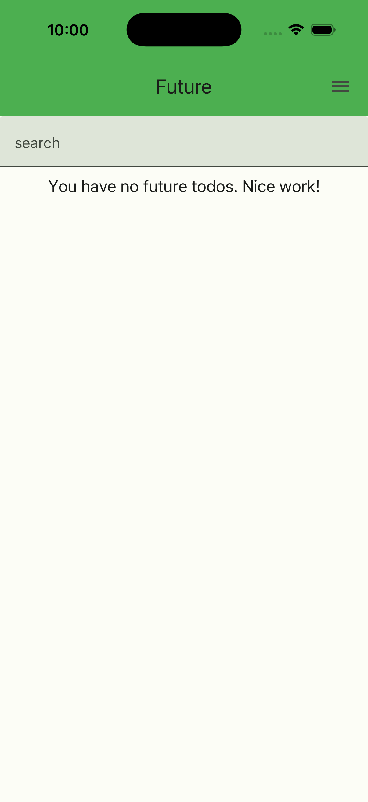

**Drawer Open:**

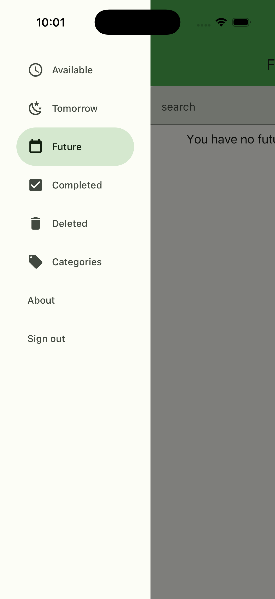

#### Navigation Elements

- **Add button** (+): Creates new todo
- **Todo list items**: Tap to navigate to detail screen
- **Search bar**: Filter todos by name
- **Pagination controls**: Navigate between pages
- **Drawer items**: Navigate to other sections

#### Notes

- Shows todos deferred to a specific future date
- Grouped by defer date
- Empty state message shown when no todos
- Back button is not shown (initial route in stack)

---

### Completed List

**URL**: `/todos/completed`
**Stack**: CompletedStack → CompletedTodos
**Auth Required**: Yes

#### Header Elements

| Breakpoint | Title     | Back Button | Hamburger Menu |
| ---------- | --------- | ----------- | -------------- |
| Large      | Completed | No          | No             |
| Medium     | Completed | No          | Yes            |

#### Drawer Behavior

| Breakpoint | Type        | Behavior                  |
| ---------- | ----------- | ------------------------- |
| Large      | Permanent   | Always visible as sidebar |
| Medium     | Collapsible | Toggle via hamburger menu |

#### Screenshots

##### Large Breakpoint (≥ 600px)

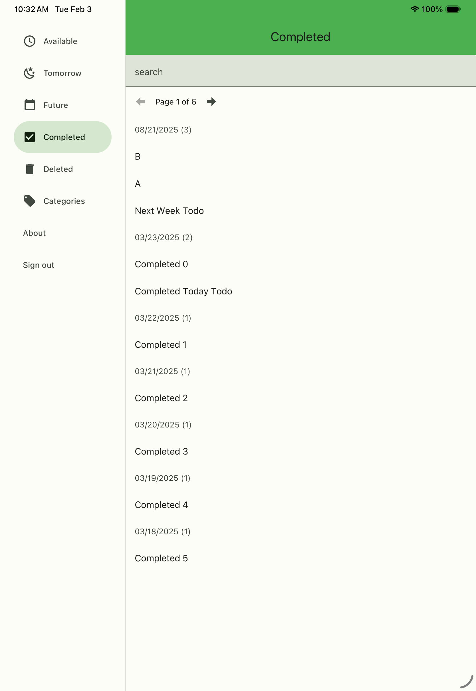

##### Medium Breakpoint (< 600px)

**Drawer Closed:**

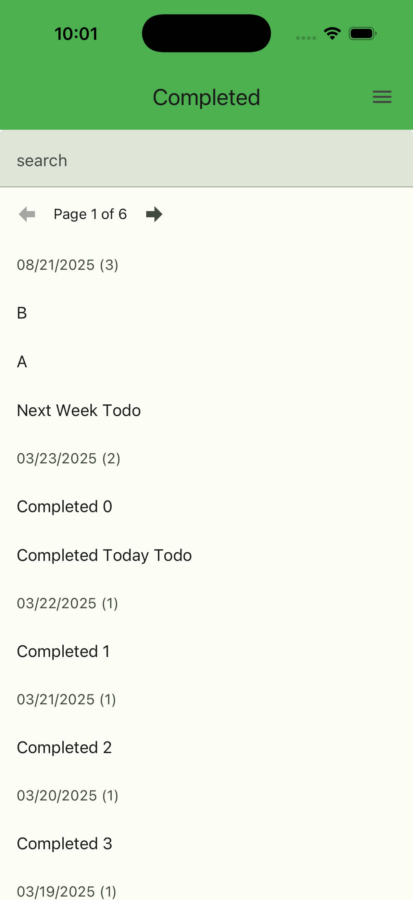

**Drawer Open:**

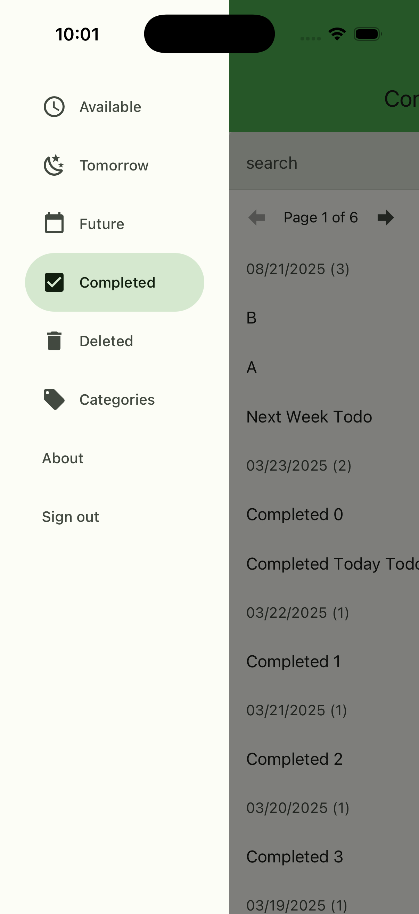

#### Navigation Elements

- **Todo list items**: Tap to navigate to detail screen
- **Search bar**: Filter todos by name
- **Pagination controls**: Navigate between pages
- **Drawer items**: Navigate to other sections

#### Notes

- Shows completed todos (checked off)
- No Add button (can't create completed todos directly)
- Grouped by completion date
- Back button is not shown (initial route in stack)

---

### Deleted List

**URL**: `/todos/deleted`
**Stack**: DeletedStack → DeletedTodos
**Auth Required**: Yes

#### Header Elements

| Breakpoint | Title   | Back Button | Hamburger Menu |
| ---------- | ------- | ----------- | -------------- |
| Large      | Deleted | No          | No             |
| Medium     | Deleted | No          | Yes            |

#### Drawer Behavior

| Breakpoint | Type        | Behavior                  |
| ---------- | ----------- | ------------------------- |
| Large      | Permanent   | Always visible as sidebar |
| Medium     | Collapsible | Toggle via hamburger menu |

#### Screenshots

##### Large Breakpoint (≥ 600px)

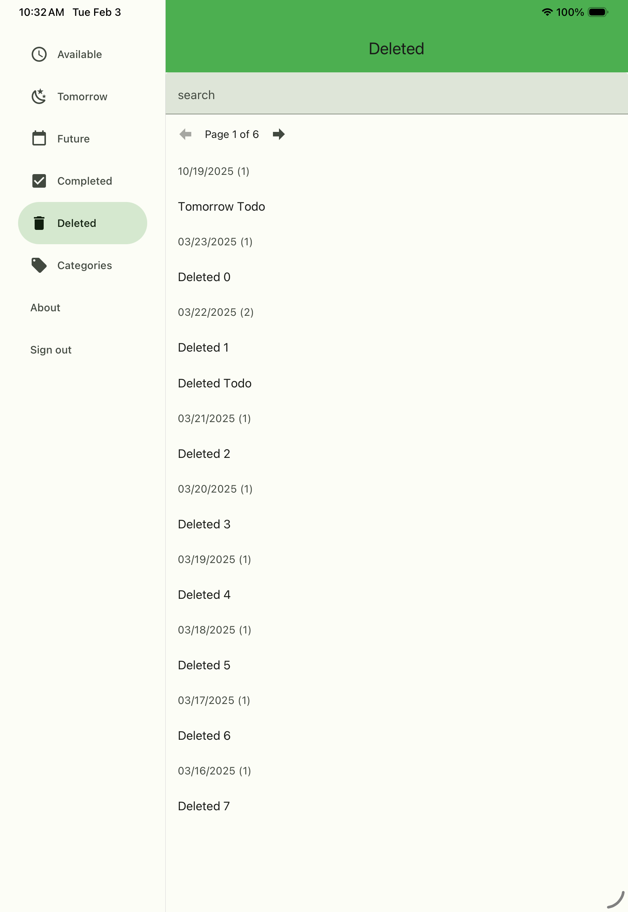

##### Medium Breakpoint (< 600px)

**Drawer Closed:**

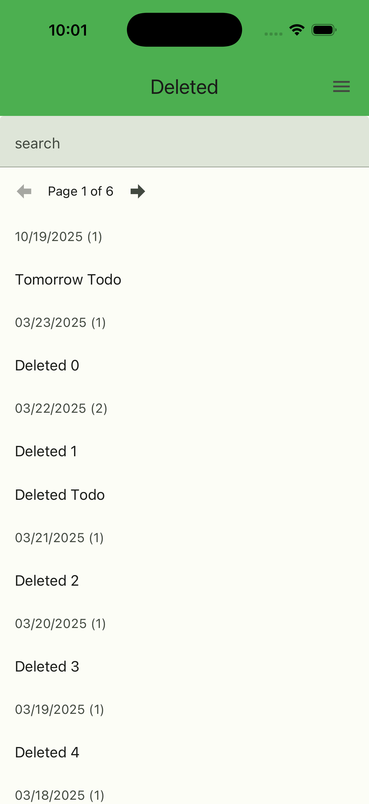

**Drawer Open:**

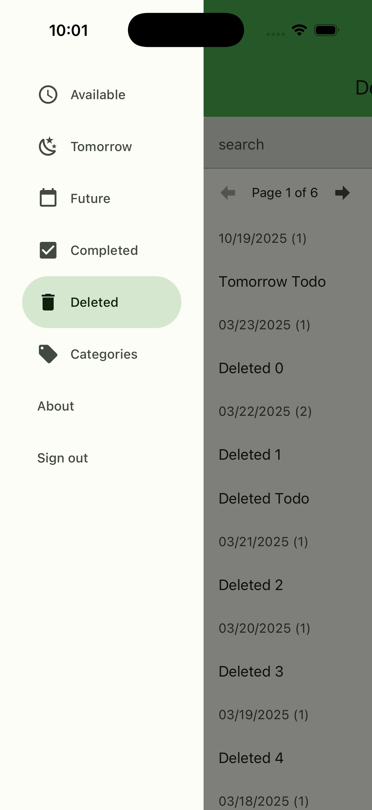

#### Navigation Elements

- **Todo list items**: Tap to navigate to detail screen (allows restoration)
- **Search bar**: Filter todos by name
- **Pagination controls**: Navigate between pages
- **Drawer items**: Navigate to other sections

#### Notes

- Shows soft-deleted todos
- No Add button (can't create deleted todos directly)
- Todos can be restored from detail view
- Back button is not shown (initial route in stack)

---

### Category List

**URL**: `/categories`
**Stack**: CategoriesStack → CategoryList
**Auth Required**: Yes

#### Header Elements

| Breakpoint | Title      | Back Button | Hamburger Menu |
| ---------- | ---------- | ----------- | -------------- |
| Large      | Categories | No          | No             |
| Medium     | Categories | No          | Yes            |

#### Drawer Behavior

| Breakpoint | Type        | Behavior                  |
| ---------- | ----------- | ------------------------- |
| Large      | Permanent   | Always visible as sidebar |
| Medium     | Collapsible | Toggle via hamburger menu |

#### Screenshots

##### Large Breakpoint (≥ 600px)

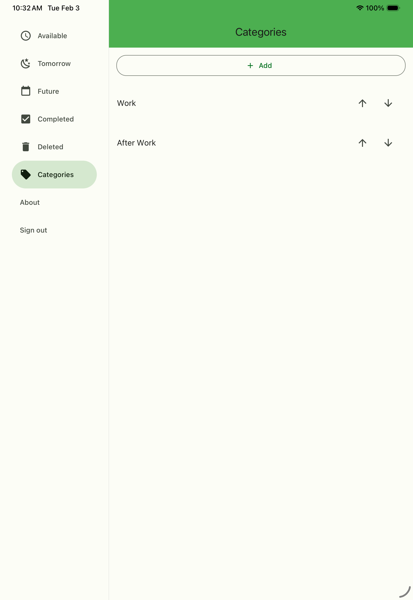

##### Medium Breakpoint (< 600px)

**Drawer Closed:**

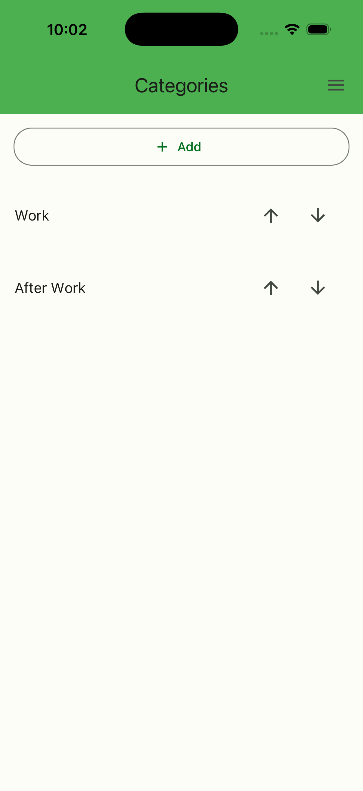

**Drawer Open:**

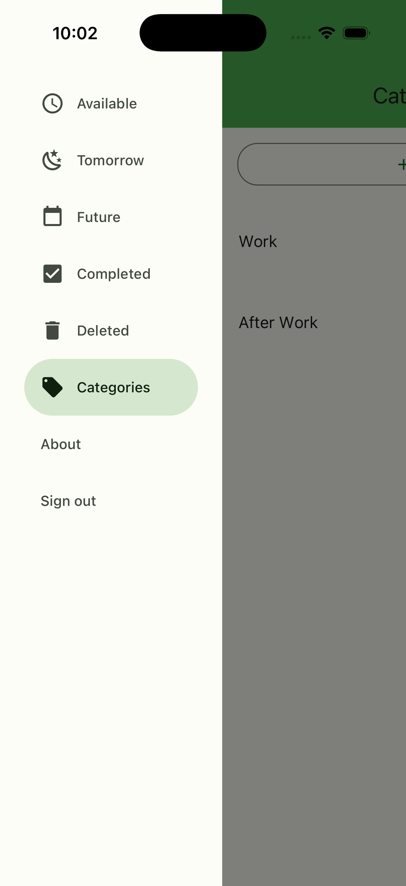

#### Navigation Elements

- **Add button** (+): Creates new category (navigates to `/categories/new`)
- **Category list items**: Tap to edit category
- **Drawer items**: Navigate to other sections

#### Notes

- Shows all user-created categories
- Each category displays its name and color
- Back button is not shown (initial route in stack)
- Categories are used to organize todos

---

### Category Detail - Edit Mode

**URL**: `/categories/:id`
**Stack**: CategoriesStack → CategoryDetail
**Auth Required**: Yes

#### Header Elements

| Breakpoint | Title         | Back Button | Hamburger Menu |
| ---------- | ------------- | ----------- | -------------- |
| Large      | Edit Category | Yes         | No             |
| Medium     | Edit Category | Yes         | Yes            |

#### Drawer Behavior

| Breakpoint | Type        | Behavior                  |
| ---------- | ----------- | ------------------------- |
| Large      | Permanent   | Always visible as sidebar |
| Medium     | Collapsible | Toggle via hamburger menu |

#### Screenshots

##### Large Breakpoint (≥ 600px)

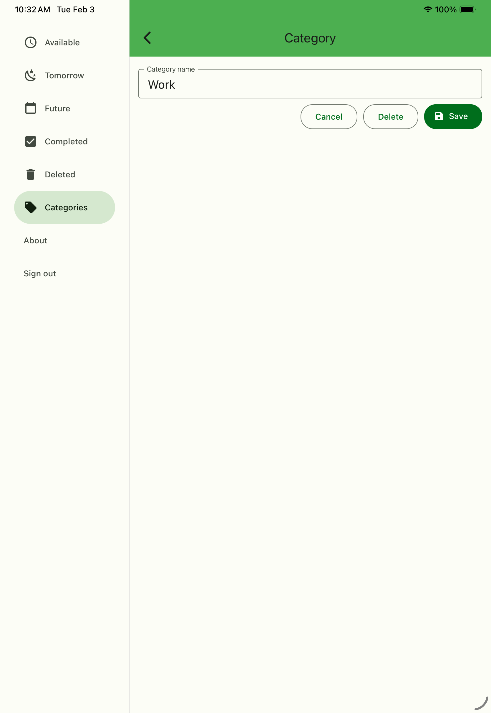

##### Medium Breakpoint (< 600px)

**Drawer Closed:**

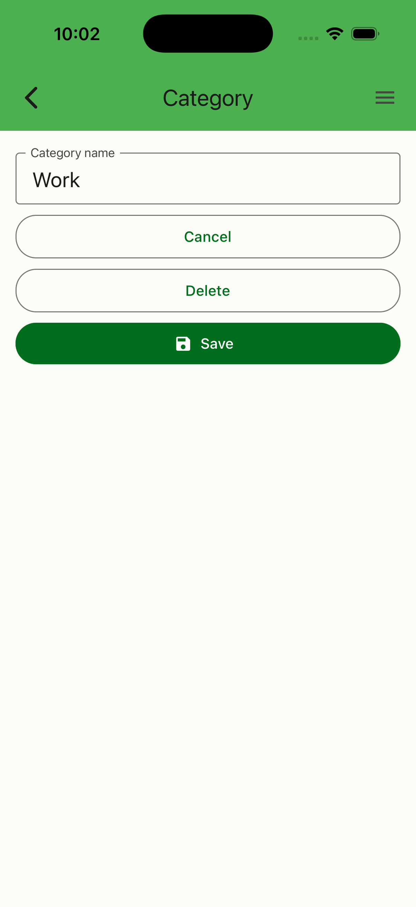

**Drawer Open:**


#### Navigation Elements

- **Back button**: Returns to Category List
- **Save button**: Updates category (navigates back to list)
- **Delete button**: Deletes category (navigates back to list)
- **Cancel button**: Discards changes (navigates back to list)
- **Name field**: Edit category name
- **Color picker**: Select category color

#### Notes

- Back button is present (not initial route in stack)
- Form validates that name is not empty
- Color picker shows Material Design colors
- Delete button includes confirmation

---

### Category Detail - New Mode

**URL**: `/categories/new`
**Stack**: CategoriesStack → CategoryDetail
**Auth Required**: Yes

#### Header Elements

| Breakpoint | Title        | Back Button | Hamburger Menu |
| ---------- | ------------ | ----------- | -------------- |
| Large      | New Category | Yes         | No             |
| Medium     | New Category | Yes         | Yes            |

#### Drawer Behavior

| Breakpoint | Type        | Behavior                  |
| ---------- | ----------- | ------------------------- |
| Large      | Permanent   | Always visible as sidebar |
| Medium     | Collapsible | Toggle via hamburger menu |

#### Screenshots

##### Large Breakpoint (≥ 600px)


##### Medium Breakpoint (< 600px)

**Drawer Closed:**

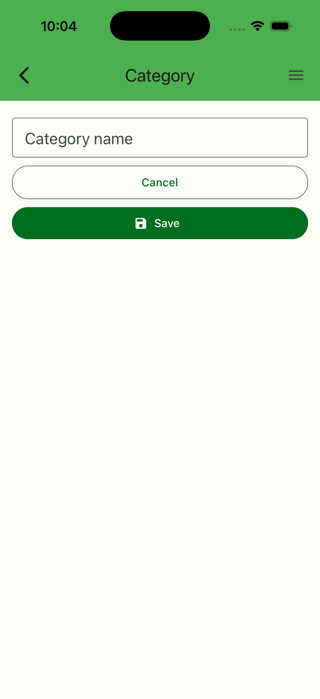

**Drawer Open:**

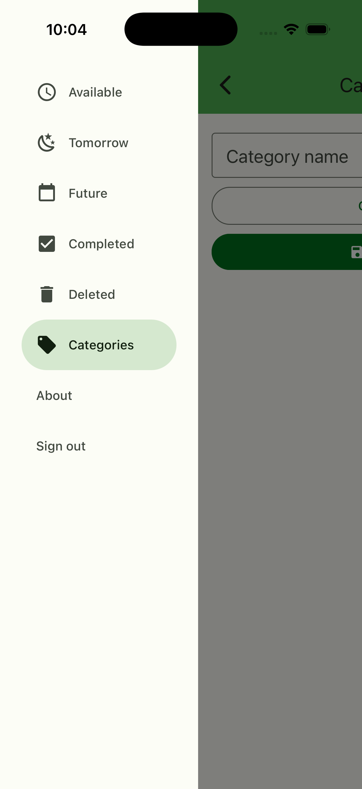

#### Navigation Elements

- **Back button**: Returns to Category List (discards new category)
- **Save button**: Creates category (navigates back to list)
- **Cancel button**: Discards new category (navigates back to list)
- **Name field**: Enter category name
- **Color picker**: Select category color

#### Notes

- Same UI as edit mode, but title is "New Category"
- No delete button (can't delete unsaved category)
- Form starts with empty name and default color
- Save creates new category via API

---

### Sign In

**URL**: `/signin`
**Stack**: AuthStack → SignInScreen
**Auth Required**: No

#### Header Elements

| Breakpoint | Title   | Back Button | Hamburger Menu |
| ---------- | ------- | ----------- | -------------- |
| Large      | Sign In | No          | No             |
| Medium     | Sign In | No          | Yes            |

#### Drawer Behavior

| Breakpoint | Type        | Behavior                                                    |
| ---------- | ----------- | ----------------------------------------------------------- |
| Large      | Permanent   | Always visible with limited items (Sign in, Sign up, About) |
| Medium     | Collapsible | Toggle via hamburger menu                                   |

#### Screenshots

##### Large Breakpoint (≥ 600px)

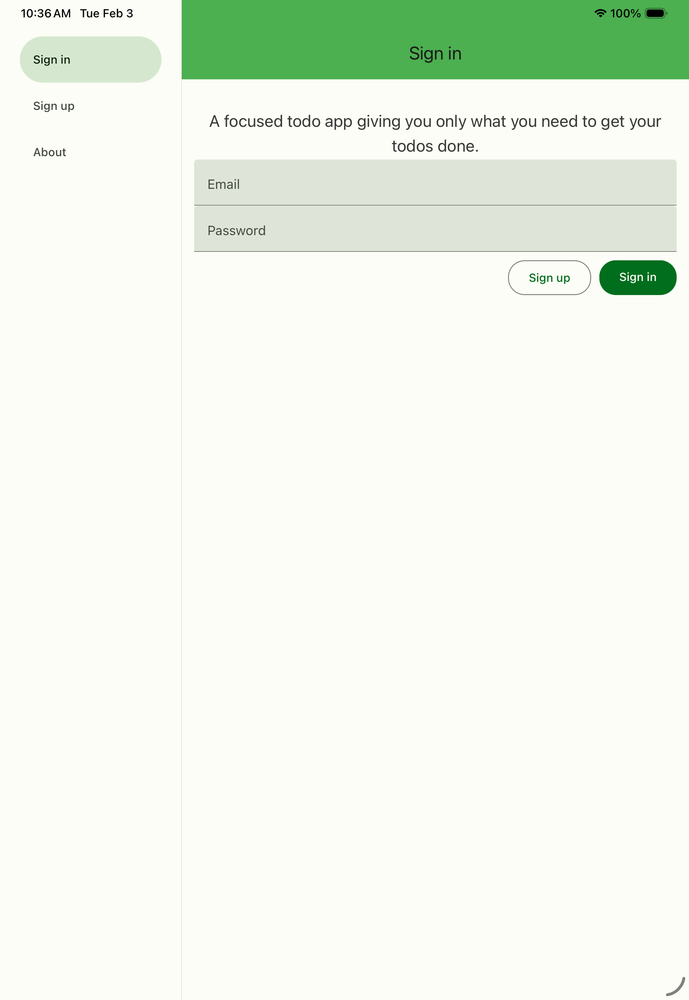

##### Medium Breakpoint (< 600px)

**Drawer Closed:**

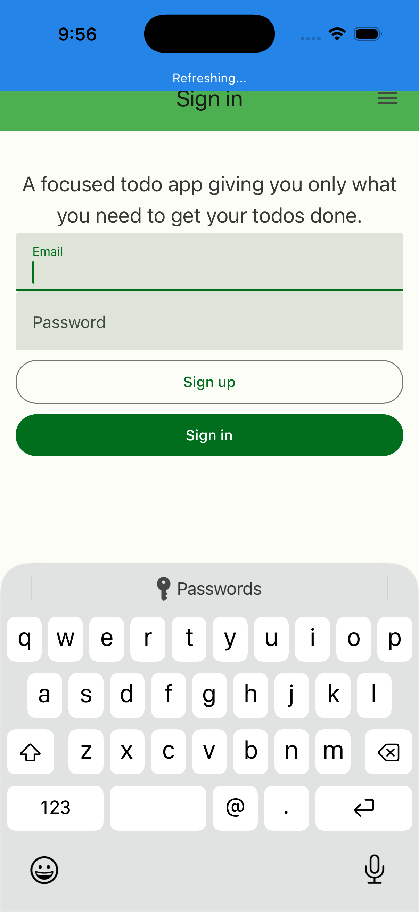

**Drawer Open:**

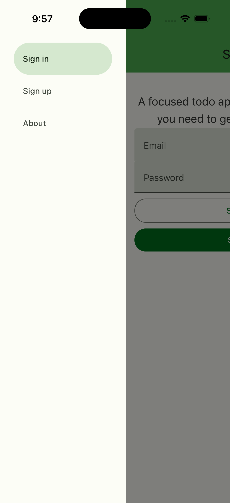

#### Navigation Elements

- **Email field**: Enter email address
- **Password field**: Enter password
- **Sign In button**: Authenticates user (navigates to Available List on success)
- **"Don't have an account?" link**: Navigates to Sign Up screen
- **Drawer items**: Sign in, Sign up, About (limited set for unauthenticated users)

#### Notes

- Back button is not shown (initial route in stack)
- Drawer shows reduced navigation options (no todo sections)
- Form validates email format and password presence
- Successful login navigates to `/todos/available`
- Error messages display for invalid credentials

---

### About

**URL**: `/about`
**Stack**: AboutStack → AboutScreen
**Auth Required**: No (accessible to both authenticated and unauthenticated users)

#### Header Elements

| Breakpoint | Title | Back Button | Hamburger Menu |
| ---------- | ----- | ----------- | -------------- |
| Large      | About | No          | No             |
| Medium     | About | No          | Yes            |

#### Drawer Behavior

| Breakpoint | Type        | Behavior                                    |
| ---------- | ----------- | ------------------------------------------- |
| Large      | Permanent   | Always visible (items depend on auth state) |
| Medium     | Collapsible | Toggle via hamburger menu                   |

#### Screenshots

##### Large Breakpoint (≥ 600px)

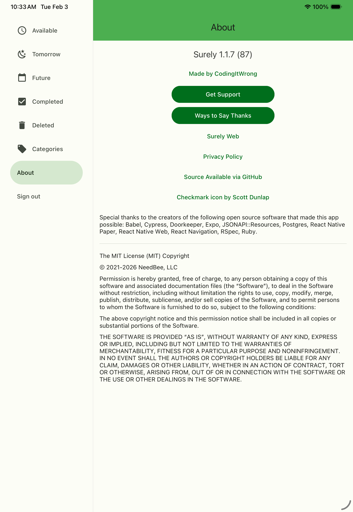

##### Medium Breakpoint (< 600px)

**Drawer Closed:**

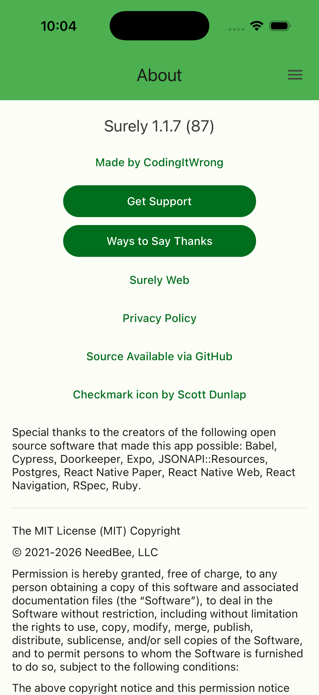

**Drawer Open:**

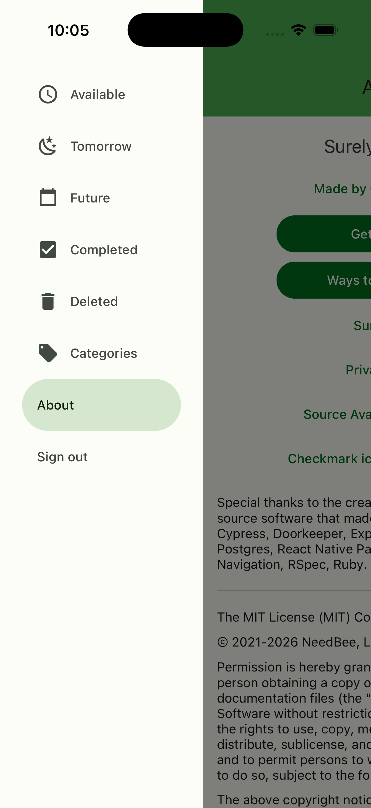

#### Navigation Elements

- **Support link**: Navigates to Support screen
- **Privacy Policy link**: Navigates to Privacy screen
- **Say Thanks link**: Navigates to Thanks screen
- **App Store badge**: Links to iOS app on App Store (web only)
- **GitHub link**: Opens GitHub repository in browser
- **Drawer items**: Navigate to other sections

#### Notes

- Back button is not shown (initial route in stack)
- Available to both authenticated and unauthenticated users
- Contains links to sub-screens (Support, Privacy, Thanks)
- Shows app version and description

---

### Support

**URL**: `/about/support`
**Stack**: AboutStack → SupportScreen
**Auth Required**: No

#### Header Elements

| Breakpoint | Title   | Back Button | Hamburger Menu |
| ---------- | ------- | ----------- | -------------- |
| Large      | Support | Yes         | No             |
| Medium     | Support | Yes         | Yes            |

#### Drawer Behavior

| Breakpoint | Type        | Behavior                                    |
| ---------- | ----------- | ------------------------------------------- |
| Large      | Permanent   | Always visible (items depend on auth state) |
| Medium     | Collapsible | Toggle via hamburger menu                   |

#### Screenshots

##### Large Breakpoint (≥ 600px)

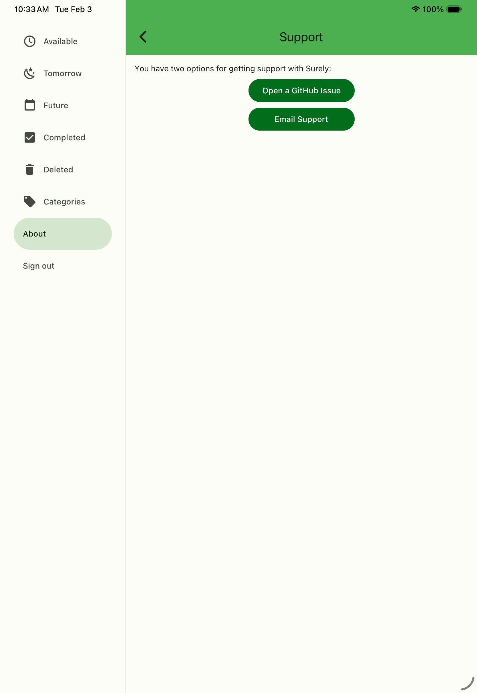

##### Medium Breakpoint (< 600px)

**Drawer Closed:**

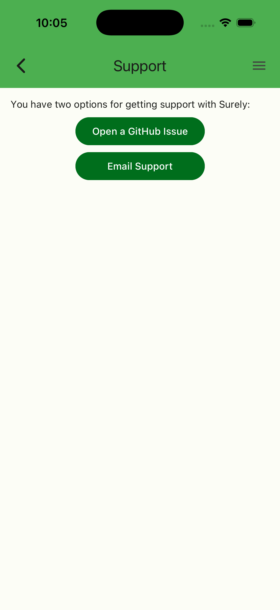

**Drawer Open:**

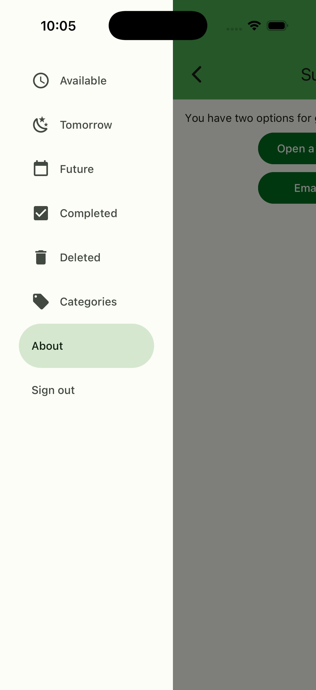

#### Navigation Elements

- **Back button**: Returns to About screen
- **Email link**: Opens email client to contact support
- **External links**: Open in browser/email client

#### Notes

- Back button is present (not initial route in stack)
- Contains static support information
- Email links use `mailto:` protocol

---

## Navigation Flow

### Stack Organization

The app is organized into the following stacks:

```
DrawerNavigator (Root)
├── AvailableStack
│   ├── AvailableTodos (list)
│   └── AvailableTodoDetail (detail)
├── TomorrowStack
│   ├── TomorrowTodos (list)
│   └── TomorrowTodoDetail (detail)
├── FutureStack
│   ├── FutureTodos (list)
│   └── FutureTodoDetail (detail)
├── CompletedStack
│   ├── CompletedTodos (list)
│   └── CompletedTodoDetail (detail)
├── DeletedStack
│   ├── DeletedTodos (list)
│   └── DeletedTodoDetail (detail)
├── CategoriesStack
│   ├── CategoryList (list)
│   └── CategoryDetail (detail/new)
├── AboutStack
│   ├── AboutScreen
│   ├── SupportScreen
│   ├── PrivacyScreen
│   └── ThanksScreen
└── AuthStack (when not logged in)
    ├── SignInScreen
    └── SignUpScreen
```

### Navigation Patterns

#### List to Detail

- All list screens follow the same pattern
- Tapping a list item navigates to detail screen in same stack
- Detail screen shows back button to return to list

#### Cross-Stack Navigation

- Completing a todo navigates from AvailableStack to CompletedStack
- Deleting a todo navigates from any stack to DeletedStack
- Deferring a todo navigates from AvailableStack to TomorrowStack or FutureStack
- Restoring a deleted todo navigates from DeletedStack to AvailableStack

#### Authentication Flow

- Successful sign in replaces AuthStack with authenticated drawer navigator
- Sign out navigates back to AuthStack (SignInScreen)
- About section is accessible from both authenticated and unauthenticated states

---

## Quick Reference Table

| Screen                 | URL                    | Initial Route | Back Button | Drawer Toggle (Medium) | Auth Required |
| ---------------------- | ---------------------- | ------------- | ----------- | ---------------------- | ------------- |
| Available List         | `/todos/available`     | Yes           | No          | Yes                    | Yes           |
| Available Detail       | `/todos/available/:id` | No            | Yes         | Yes                    | Yes           |
| Tomorrow List          | `/todos/tomorrow`      | Yes           | No          | Yes                    | Yes           |
| Tomorrow Detail        | `/todos/tomorrow/:id`  | No            | Yes         | Yes                    | Yes           |
| Future List            | `/todos/future`        | Yes           | No          | Yes                    | Yes           |
| Future Detail          | `/todos/future/:id`    | No            | Yes         | Yes                    | Yes           |
| Completed List         | `/todos/completed`     | Yes           | No          | Yes                    | Yes           |
| Completed Detail       | `/todos/completed/:id` | No            | Yes         | Yes                    | Yes           |
| Deleted List           | `/todos/deleted`       | Yes           | No          | Yes                    | Yes           |
| Deleted Detail         | `/todos/deleted/:id`   | No            | Yes         | Yes                    | Yes           |
| Category List          | `/categories`          | Yes           | No          | Yes                    | Yes           |
| Category Detail (edit) | `/categories/:id`      | No            | Yes         | Yes                    | Yes           |
| Category Detail (new)  | `/categories/new`      | No            | Yes         | Yes                    | Yes           |
| Sign In                | `/signin`              | Yes           | No          | Yes                    | No            |
| Sign Up                | `/signup`              | No            | Yes         | Yes                    | No            |
| About                  | `/about`               | Yes           | No          | Yes                    | No            |
| Support                | `/about/support`       | No            | Yes         | Yes                    | No            |
| Privacy                | `/about/privacy`       | No            | Yes         | Yes                    | No            |
| Thanks                 | `/about/say-thanks`    | No            | Yes         | Yes                    | No            |

---

## Code References

### Navigation Configuration

- **Main Navigation**: `src/Navigation.js` - Drawer and stack navigator setup
- **Navigation Bar**: `src/components/NavigationBar.js` - Custom header with back button and drawer toggle
- **Navigation Drawer**: `src/components/NavigationDrawer.js` - Drawer content and items
- **Breakpoints**: `src/breakpoints.js` - Responsive breakpoint definitions

### Screen Components

- **Todo Lists**: `src/screens/TodoList/` - Available, Tomorrow, Future, Completed, Deleted
- **Todo Detail**: `src/screens/TodoDetail/` - Detail view and form
- **Categories**: `src/screens/CategoryList.js`, `src/screens/CategoryDetail.js`
- **Authentication**: `src/screens/Login/` - SignIn and SignUp forms
- **About**: `src/screens/About/` - About, Support, Privacy, Thanks

### Related Documentation

- **Navigation Architecture**: `docs/navigation.md` - Detailed navigation system overview
- **Responsive Design**: Implementation uses `react-native-style-queries` (see `src/sharedStyleQueries.js`)
- **React Navigation**: Official docs at https://reactnavigation.org/

---

## Notes

- **Consistent Patterns**: All list screens follow the same navigation pattern (no back button, drawer toggle on medium)
- **Detail Screens**: All detail screens show back button and maintain drawer access
- **Responsive UI**: Navigation adapts automatically based on screen width
- **Deep Linking**: All screens support direct URL navigation
- **History Management**: Web version maintains proper browser history
- **Accessibility**: All navigation elements include proper accessibility labels and roles
